# ml-grasp-rl-imitation-sim

> ### Clean-room reimplementation
> This repository is an **independent reimplementation of a problem class**, built from
> scratch on personal time using public or synthetic data and open-source simulation.
> It is **not** derived from, and contains no material belonging to, any employer or
> client: no employer source code, schematics, calibration data, client data or internal
> documentation. It exists to demonstrate the architecture and engineering approach only.

Learned grasping in simulation: a MuJoCo lift-and-hold task, a documented reward
design, SAC from scratch, behaviour cloning and DAgger from recorded
demonstrations, the two combined, and a domain-randomisation ablation measured
against a held-out distribution that stands in for a real robot. Every success
rate is reported over five seeds with confidence intervals, because a
reinforcement-learning number from one seed is noise.

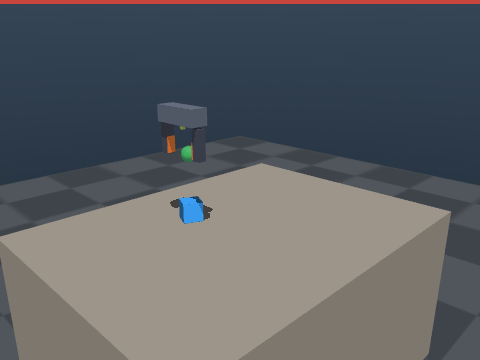

*The scripted expert that produces the demonstrations. Green bar: the success
condition is being met. Blue bar: lift height.*

---

## What is here

| | |
| --- | --- |
| **Task** | Close a parallel-jaw hand on a box, lift it to a hold point 0.15 m above the table, and still be holding it 4 s in |
| **Simulator** | MuJoCo 3.11, hand-written MJCF, contact-based grasp detection |
| **Observation / action** | 32-D state / 4-D Cartesian delta plus gripper |
| **Algorithms** | SAC (written out, not imported), behaviour cloning, DAgger, and BC+SAC with pinned demonstrations and a scale-normalised cloning term |
| **Randomisation** | 11 parameters across dynamics, actuation and sensing; four training levels plus a held-out shifted distribution |
| **Reporting** | 5 seeds x 100 episodes per cell, mean with a 95% t interval across seeds |
| **Isaac Lab** | Ported and **working on Isaac Sim 5.1**: all 7 bring-up checks pass, including reward parity with the MuJoCo implementation to ~5e-08 and randomisation driven by the same JSON — [envs/isaac/README.md](envs/isaac/README.md) |

Nothing here has touched hardware. `shifted` is a **proxy** for a real robot,
never called a real-robot number: [docs/sim-to-real.md](docs/sim-to-real.md).
The closest thing to an independent test is the Isaac port, and it is
unflattering: across five seeds per randomisation level, MuJoCo-trained policies
score **0.05 to 0.08** there with no adaptation, against **1.000** for the
scripted expert in the same environment. One seed reached 0.41 and the other
nineteen were at or near zero.

---

## Run it

```bash
./scripts/setup.sh          # venv, CPU torch, deps, runs the tests
make demo                   # scripted expert, ~10 s, no GPU, no display
```

`make demo` is the smoke test: it runs the scripted expert on the nominal world,
prints a success rate with a confidence interval, and fails loudly if the scene
has been broken.

```bash
make check                  # lint + 50 unit tests, what CI runs
make experiments            # the whole grid: 50 runs, about 3 hours on 8 cores
make plots readme           # regenerate every figure and every table here
make videos                 # rollout clips (needs a GL context)
make export RUN=experiments/runs/bcrl_medium_s0   # TorchScript for deployment
```

Or in Docker — the image runs the unit tests as part of its build, so a green
build is a working install:

```bash
make docker-build && make docker-demo
```

---

## Results

Every table below is written by `analysis/readme_tables.py` from the JSON in
`experiments/results/`, so the README cannot drift from the runs. The protocol —
seed blocks, which interval and why — is in
[docs/evaluation.md](docs/evaluation.md).

<!-- RESULTS:START -->

### Success rate by method

100 episodes per seed, deterministic actions, success read at the final step. Cells are the mean over seeds with a 95% t interval across seeds.

| method | seeds | eval: `none` | eval: `medium` | eval: `shifted` |
| --- | ---: | --- | --- | --- |
| scripted expert (reference) | -- | 1.000 | 0.940 | 0.470 |
| behaviour cloning | 5 | **1.000** [1.000, 1.000] | **0.900** [0.868, 0.932] | **0.236** [0.179, 0.293] |
| behaviour cloning + DAgger | 5 | **0.966** [0.937, 0.995] | **0.862** [0.809, 0.915] | **0.408** [0.344, 0.472] |
| SAC, no randomisation | 5 | **0.402** [0.000, 1.000] | **0.272** [0.000, 0.723] | **0.002** [0.000, 0.008] |
| SAC, low randomisation | 5 | **0.146** [0.000, 0.511] | **0.080** [0.000, 0.282] | **0.008** [0.000, 0.030] |
| SAC, medium randomisation | 5 | **0.220** [0.007, 0.433] | **0.128** [0.000, 0.302] | **0.004** [0.000, 0.011] |
| SAC, wide randomisation | 5 | **0.122** [0.000, 0.331] | **0.058** [0.000, 0.167] | **0.000** [0.000, 0.000] |
| SAC + entropy floor, no randomisation | 5 | **0.986** [0.967, 1.000] | **0.640** [0.571, 0.709] | **0.000** [0.000, 0.000] |
| SAC + entropy floor, low randomisation | 5 | **0.364** [0.000, 0.838] | **0.206** [0.000, 0.496] | **0.002** [0.000, 0.008] |
| SAC + entropy floor, medium randomisation | 5 | **0.582** [0.028, 1.000] | **0.364** [0.004, 0.724] | **0.004** [0.000, 0.015] |
| SAC + entropy floor, wide randomisation | 5 | **0.390** [0.016, 0.764] | **0.240** [0.000, 0.506] | **0.006** [0.000, 0.017] |
| BC + SAC, no randomisation | 5 | **1.000** [1.000, 1.000] | **0.516** [0.454, 0.578] | **0.002** [0.000, 0.008] |
| BC + SAC, low randomisation | 5 | **0.968** [0.934, 1.000] | **0.640** [0.612, 0.668] | **0.028** [0.000, 0.065] |
| BC + SAC, medium randomisation | 5 | **0.968** [0.934, 1.000] | **0.726** [0.658, 0.794] | **0.032** [0.000, 0.064] |
| BC + SAC, wide randomisation | 5 | **0.976** [0.942, 1.000] | **0.756** [0.727, 0.785] | **0.072** [0.050, 0.094] |

`none` is the nominal world, `medium` a training-like distribution, and `shifted` the held-out worlds that stand in for a real robot ([why that is a proxy](docs/sim-to-real.md)).

### Randomisation ablation: SAC from scratch

Every policy evaluated twice: on the distribution it trained on, and on the held-out `shifted` worlds. The gap is what matters -- a policy that scores well on its own distribution and badly on `shifted` has learned the simulator rather than the task.

| trained with | seeds | on its own distribution | on `shifted` | gap |
| --- | ---: | --- | --- | ---: |
| `none` | 5 | **0.402** [0.000, 1.000] | **0.002** [0.000, 0.008] | +0.400 |
| `low` | 5 | **0.112** [0.000, 0.377] | **0.008** [0.000, 0.030] | +0.104 |
| `medium` | 5 | **0.128** [0.000, 0.302] | **0.004** [0.000, 0.011] | +0.124 |
| `high` | 5 | **0.064** [0.000, 0.177] | **0.000** [0.000, 0.000] | +0.064 |

* `shifted_high_vs_none`: difference -0.002 in mean success, Welch t = -1.00
* `shifted_medium_vs_none`: difference +0.002 in mean success, Welch t = 0.63

### Randomisation ablation: SAC from scratch, with a tuned entropy floor

The same runs as the table above with one line changed -- a floor under the entropy coefficient, at the value that works for each level ([docs/exploration.md](docs/exploration.md)). Same 200 000-step budget. Fixing the collapse roughly triples the own-distribution column and leaves the gap where it was, which is worth knowing: the poor transfer is not an artefact of an undertrained baseline.

| trained with | seeds | on its own distribution | on `shifted` | gap |
| --- | ---: | --- | --- | ---: |
| `none` | 5 | **0.986** [0.967, 1.000] | **0.000** [0.000, 0.000] | +0.986 |
| `low` | 5 | **0.228** [0.000, 0.527] | **0.002** [0.000, 0.008] | +0.226 |
| `medium` | 5 | **0.364** [0.004, 0.724] | **0.004** [0.000, 0.015] | +0.360 |
| `high` | 5 | **0.228** [0.020, 0.436] | **0.006** [0.000, 0.017] | +0.222 |

* `shifted_high_vs_none`: difference +0.006 in mean success, Welch t = 1.50
* `shifted_medium_vs_none`: difference +0.004 in mean success, Welch t = 1.00

### Randomisation ablation: imitation-seeded SAC

The same ablation for the imitation-plus-RL variant, which starts from a cloned policy and keeps the demonstrations pinned in the replay buffer.

| trained with | seeds | on its own distribution | on `shifted` | gap |
| --- | ---: | --- | --- | ---: |
| `none` | 5 | **1.000** [1.000, 1.000] | **0.002** [0.000, 0.008] | +0.998 |
| `low` | 5 | **0.804** [0.778, 0.830] | **0.028** [0.000, 0.065] | +0.776 |
| `medium` | 5 | **0.726** [0.658, 0.794] | **0.032** [0.000, 0.064] | +0.694 |
| `high` | 5 | **0.662** [0.625, 0.699] | **0.072** [0.050, 0.094] | +0.590 |

* `shifted_high_vs_none`: difference +0.070 in mean success, Welch t = 8.49
* `shifted_medium_vs_none`: difference +0.030 in mean success, Welch t = 2.55

### Scripted expert, for reference

100 episodes per level, 95% Wilson intervals (one policy, so the binomial interval is the right one).

| level | success | grasp rate | mean peak lift |
| --- | --- | ---: | ---: |
| `none` | **1.000** [0.963, 1.000] | 1.00 | 0.127 m |
| `low` | **0.980** [0.930, 0.994] | 1.00 | 0.128 m |
| `medium` | **0.940** [0.875, 0.972] | 1.00 | 0.128 m |
| `high` | **0.840** [0.756, 0.899] | 1.00 | 0.129 m |
| `shifted` | **0.470** [0.375, 0.567] | 0.95 | 0.086 m |

<!-- RESULTS:END -->

### What these say

The short version, with the reasoning and the caveats in
[docs/results.md](docs/results.md):

* **SAC from scratch is unreliable at this budget.** Five seeds on the nominal
  world scored 1.00, 1.00, 0.00, 0.00, 0.00 — mean 0.40, interval [0.00, 1.00].
  That interval *is* the result, and it is what the brief for this repository
  meant by "RL results from one seed are noise". The stalled seeds have a
  specific, diagnosed failure: an entropy collapse into a local optimum where
  the box is grasped and held on the table.
* **A floor under the entropy coefficient fixes it — and its value does not
  transfer.** On the nominal world a floor of 0.15 takes five seeds from 0.400
  to **0.993** at *half* the budget. A floor beats no floor at every
  randomisation level tested, but the value that does it is different for each:
  `none` fails at 0.05, `low` dies at 0.15 and needs 0.05, `medium` and `high`
  are indifferent between them. A value tuned on the nominal world takes `low`
  to zero. [docs/exploration.md](docs/exploration.md) is the whole
  investigation, including the two conclusions along the way that were wrong.
* **Demonstrations buy sample efficiency, not feasibility.** At an identical
  200 000-step budget, from-scratch SAC with a tuned floor scores **0.986** on
  the nominal world against 1.000 for the demonstration-seeded version, and
  **0.640** on `medium` against its 0.516 — from scratch is *ahead* on the
  harder evaluation. What demonstrations still buy is speed and the absence of a
  hyperparameter: they reach it inside 30 000 steps, and nobody has to know that
  the floor exists or what value it wants. Before the collapse was diagnosed
  this bullet read "demonstrations are the difference between works and does not
  work", and the matched-budget comparison does not support that.
* **Fixing the collapse does not fix transfer.** The floored policies score
  0.000–0.006 on the held-out `shifted` worlds, the same as the un-floored ones.
  So the poor sim-to-real proxy result here is not an artefact of an
  undertrained baseline, which is the first thing worth ruling out before
  believing it.
* **A second engine reproduces the failure *and* the fix — at a different
  value.** In Isaac Lab, SAC from scratch scores 0.000 on all five seeds, and
  demonstration-seeded SAC scores 0.969 [0.902, 1.000]. Carrying MuJoCo's floor
  of 0.15 across gave 0.463 against a 0.194 control and looked like a failed
  replication; sweeping the value instead gave **1.000 on three seeds of three
  at a floor of 0.30** (t = 4.71), the largest effect measured here. The floor
  is real in both engines and its value belongs to the distribution, not to the
  algorithm.
* **Randomisation buys transfer, and here it costs nothing measurable.** A
  policy trained without it is perfect on its own worlds and scores 0.002 on the
  held-out ones; wide randomisation multiplies that by thirty, to 0.072 — still
  far below the scripted expert's 0.47 on the same worlds. Scored on a *fixed*
  distribution, wider randomisation is never worse and is monotonically better
  on the harder ones, so the usual robustness-versus-performance trade-off does
  not show up at this budget.
* **Behaviour cloning degrades faster than the expert it copies.** 1.00 in
  distribution, 0.24 on the shifted worlds against the expert's 0.47: the
  expert filters its pose estimate and the memoryless clone does not.
* **A second simulator agrees about the local optimum.** Running the same SAC in
  Isaac Lab, from scratch, for 480 000 transitions produced a policy that grasps
  the box on essentially every episode and lifts it on none — the same local
  optimum three of the five MuJoCo seeds fell into. The trap belongs to the task
  and the reward shaping, not to MuJoCo. Seeding with demonstrations reaches
  0.94 there, exactly as it does in MuJoCo.
* **Policies do not transfer between the simulators.** 0.05–0.08 across five
  seeds per level, against 1.000 for the scripted expert in the same
  environment. The observation and action layouts match, so what fails is the
  behaviour, not the interface — and no randomisation level fixes it. See
  [docs/results.md](docs/results.md).

---

## The task

A box of randomised size, mass and friction starts somewhere on a table at a
random yaw. The hand starts above it, open. Success is read at the **final**
step of the episode:

```
success = (|object - hold point| < 0.05 m) AND (both finger pads in contact)
```

Reading it at the final step is what stops the obvious cheat: a policy that
flings the box upward passes through the goal sphere and, under an "at any
point" definition, scores 100%.

The hand is a free body dragged by a mocap weld, so contact is resolved by the
solver rather than imposed kinematically — a misaligned finger pair pushes the
box away instead of passing through it. There is no arm, which is the largest
simplification here and is listed first in
[docs/limitations.md](docs/limitations.md).

---

## Training curves

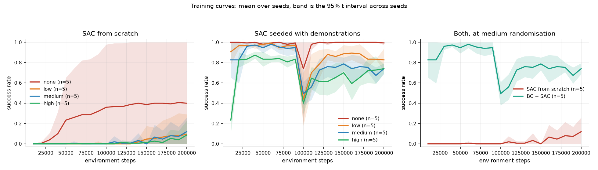

---

## The entropy floor

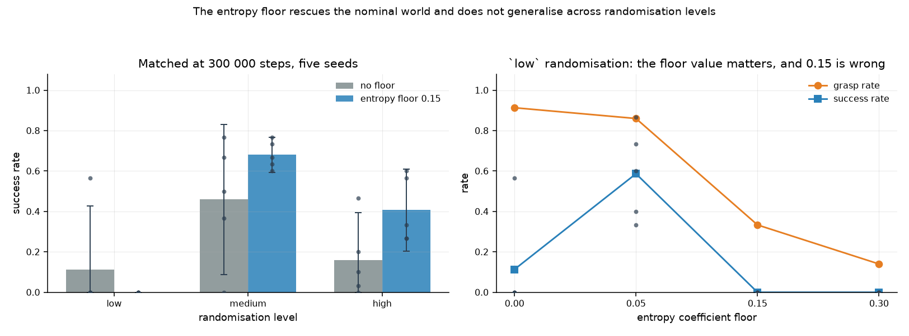

Left: success against the floor value, one line per randomisation level, five
seeds per point, with floor 0.00 as the leftmost point of each line so every
control sits on the same axes as its treatments. A floor beats no floor
everywhere; the `none` and `low` curves cross between 0.05 and 0.15 going
opposite ways, which is why no single value works. Right: the mechanism at
`low` — grasp rate falls monotonically as the floor rises while success peaks in
the middle, because a floor that keeps the policy exploring enough to find the
lift eventually keeps it too stochastic to close the fingers.

Full investigation, including the conclusions that were wrong on the way, in
[docs/exploration.md](docs/exploration.md).

---

## Reward design

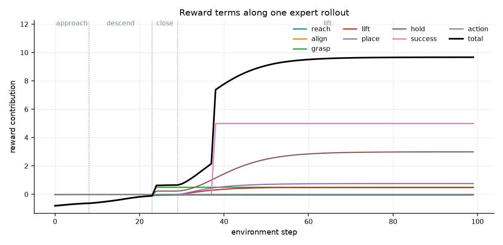

Nine terms, all in [`src/rewards/grasp_reward.py`](src/rewards/grasp_reward.py),
documented term by term with the failures that produced them in
[docs/reward-design.md](docs/reward-design.md). The short version is that two
shapings failed before this one worked:

* a **cliff instead of a hill** at the goal — every seed learned to grasp, then
  hoisted the box to the ceiling of the workspace and held it there, because
  the only thing marking the hold point was a binary bonus inside a 5 cm ball
  that a rising policy crosses in one step out of a hundred;
* a **`place` term that charged for lifting** — as an absolute distance penalty
  it made picking the box up worse than leaving it alone, and grasp rates
  halved.

Both are the same mistake: a term that is right at the optimum and wrong on the
path to it.

---

## Randomisation ablation

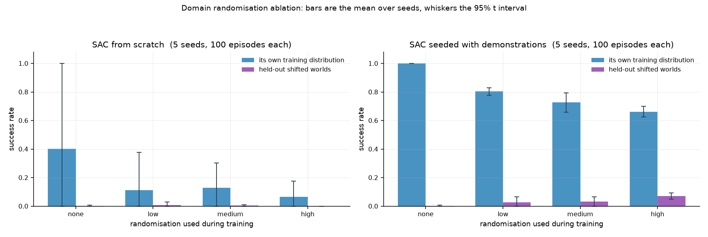

Four training levels, each evaluated on its own distribution and on the
held-out `shifted` worlds, from scratch and seeded with demonstrations. Ranges
and rationale in [docs/domain-randomisation.md](docs/domain-randomisation.md);
what the two panels do and do not show is discussed in
[docs/results.md](docs/results.md), including why the falling left-hand bars are
*not* the cost of randomisation.

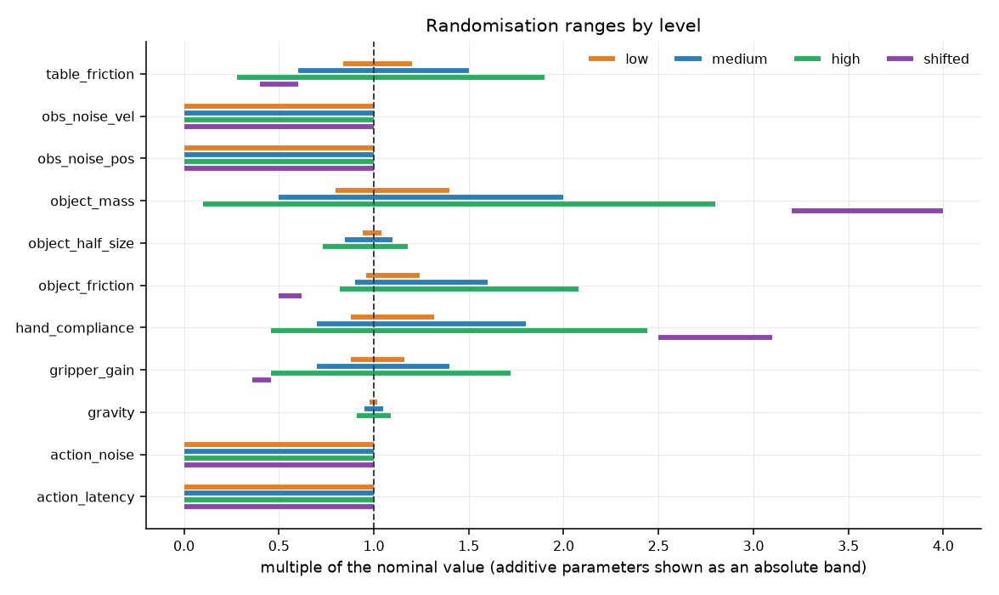

---

## Imitation

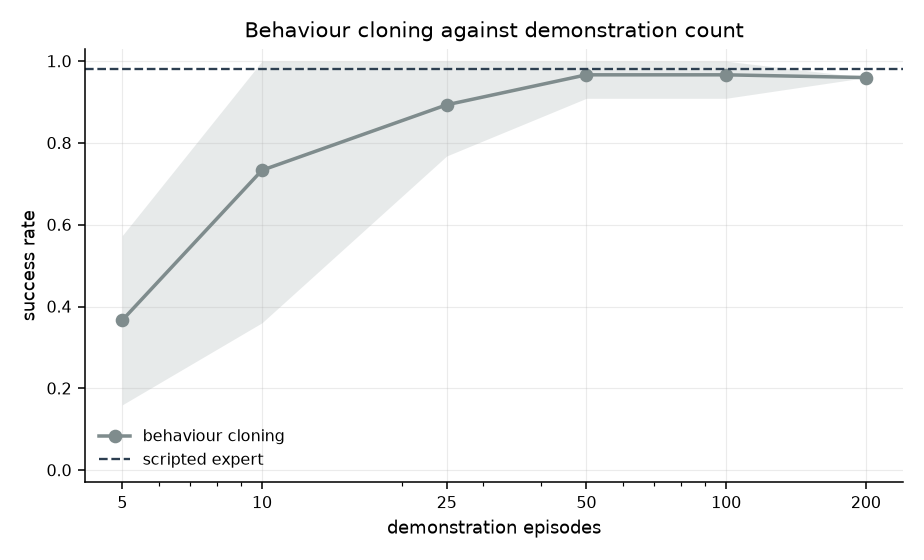

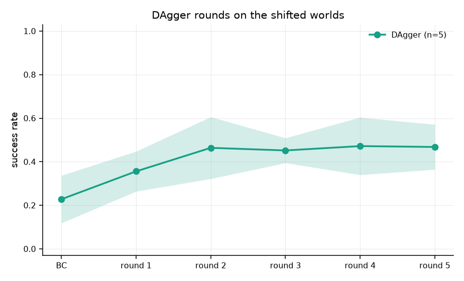

Details in [docs/imitation.md](docs/imitation.md), including the three separate
things that had to be fixed before a cloned policy could be fine-tuned with RL
without being destroyed in the first few thousand updates.

---

## Rollout videos

Every clip is rendered from the same seed block the evaluation uses, so these
are episodes from the evaluated set rather than a highlight reel — the failures
in them are the failures in the tables. `make videos` regenerates all of them.

| | |
| --- | --- |
| 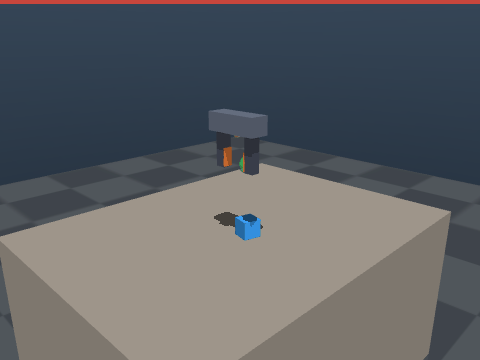 | **BC + SAC, medium randomisation** on its own distribution |
| 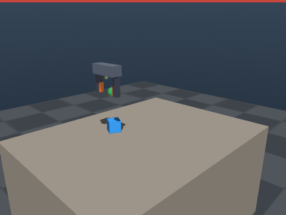 | **A stalled SAC seed** on the nominal world: it grasps the box and holds it on the table, never lifting. Three of five seeds ended here |
| 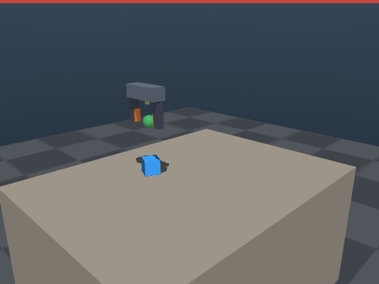 | **The same seed, rescued.** Seed 3 again, with a floor under the entropy coefficient and nothing else changed — 2 of 2 episodes succeed. The before-and-after of the one-line fix, with the seed held fixed so nothing else can explain the difference |
| 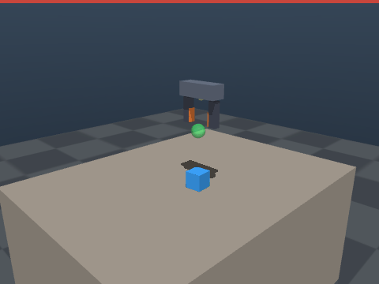 | **BC + SAC, wide randomisation**, on the held-out shifted worlds |
|  | **The same method trained without randomisation**, on the same worlds |

`videos/expert_nominal.gif` and `videos/expert_shifted.gif` show the scripted
expert on both, and `videos/sac_none.gif` is one of the two SAC seeds that did
solve the nominal task.

---

## Repository layout

```
envs/
  mujoco/            grasp_env.py, assets/grasp_scene.xml
  isaac/             Isaac Lab port (working; see its README)
src/
  rewards/           reward terms, shared by both simulators
  policies/          SAC, networks, scripted expert
  randomisation/     domain randomisation and its level configs
  utils/             evaluation protocol, confidence intervals
  train_rl.py        SAC, and the imitation-plus-RL variant
  train_il.py        behaviour cloning and DAgger
  evaluate.py        the one definition of success rate
  record_demos.py    demonstration recording
  render_rollout.py  rollout videos
demonstrations/      recorded expert trajectories (200 episodes)
experiments/         run driver, ablation, aggregation, results
analysis/            every figure in this README
docs/                design notes, evaluation protocol, limitations
tests/               environment contract, reward parity, learning machinery
```

### Documentation

| | |
| --- | --- |
| [docs/results.md](docs/results.md) | what the numbers say, including the parts that are unflattering |
| [docs/exploration.md](docs/exploration.md) | why three seeds in five stalled, the hypothesis that was wrong, and the fix |
| [docs/reward-design.md](docs/reward-design.md) | every term, and the two shapings that failed first |
| [docs/architecture.md](docs/architecture.md) | how the pieces fit, and the seed blocks |
| [docs/domain-randomisation.md](docs/domain-randomisation.md) | what is randomised, by how much, and the MuJoCo friction trap |
| [docs/imitation.md](docs/imitation.md) | demonstrations, cloning, DAgger, and fine-tuning without destroying the clone |
| [docs/evaluation.md](docs/evaluation.md) | the protocol, and which confidence interval answers which question |
| [docs/sim-to-real.md](docs/sim-to-real.md) | why `shifted` is a proxy and what it is missing |
| [docs/limitations.md](docs/limitations.md) | read before the results |
| [envs/isaac/README.md](envs/isaac/README.md) | the Isaac Lab port: bring-up results, what was wrong when it was written blind, and the open control problem |

---

## Limitations

Stated in full in [docs/limitations.md](docs/limitations.md). The ones that
change how the numbers should be read:

* **No arm** — the hand floats; no joint limits, self-collision or reachability.
* **No wrist rotation** — the pads always close along world *x*, which caps how
  large a box can be grasped and removes the alignment problem that makes real
  grasping hard.
* **No perception** — the object pose is handed to the policy; sensing
  randomisation is additive Gaussian noise, a weak model of a real estimator.
* **Dense hand-designed reward** — this shows RL solving a shaped task, not
  discovering grasping from a sparse signal.
* **No hardware** — `shifted` is a proxy for a real robot, and a lower bound on
  a real gap.
* **Isaac Lab port works, but no headline number comes from it** — all seven
  bring-up checks pass and cross-simulator transfer is measured, but every
  quoted success rate in this README was produced in MuJoCo. Four of the
  eleven randomisation parameters have no Isaac equivalent yet.

---

## Licence

MIT. See [LICENSE](LICENSE).

Simulation assets are hand-written MJCF in this repository (primitive geometry
only, no third-party meshes). MuJoCo is Apache-2.0, Gymnasium MIT, PyTorch
BSD-3-Clause. No datasets are used: all demonstrations are generated by the
scripted expert in this repository.
